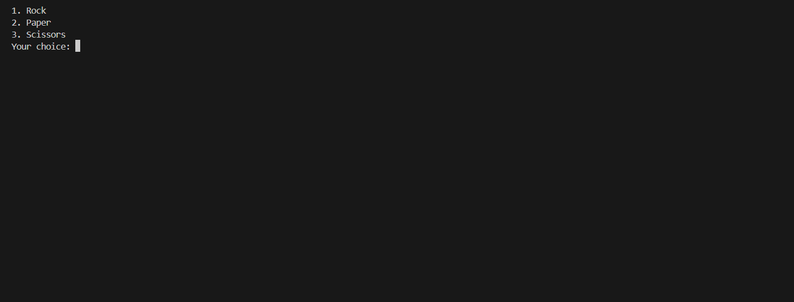
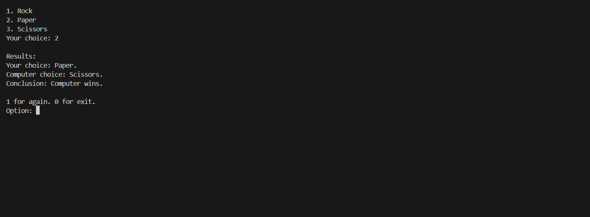
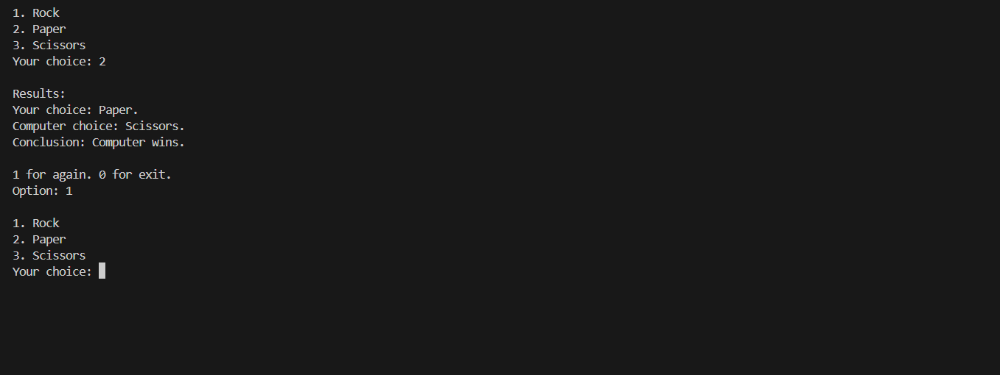

# ROCK, PAPER, SCISSORS GAME VS COMPUTER

### Intro 
This is a Rock, Paper, Scissors game in which the user plays against a computer.  
It is written in C#, while making use of the random number generator so as to aid the computer in deciding, anonymously, which symbol to pick when playing with a user.   
The game is written using VS Code, using the C# programming language.  

### How To Play
* Clone the repository to your local machine. 
* Make sure you have a C# IDE, such as VS Code.  
* Open the R_P_S folder and locate the Project.cs file.  
* Open it and open the terminal. 
* Whilst in the termminal, change directory using the cd command and navigate to R_P_S.  
* In the terminal, write "dotnet run" and wait for the project and solution file to load.  
* Once the console loads, enter your number of choice corresponding to your symbol of choice.  
* At the end, enter 1 to retry or 0 to exit.  
* Enjoy the game.  

### On Load



### On Choosing 


### On Replay



````````````````````````````````````````````````````


````````````````````````````````````````````````````
**Coded By: PeterTheDev330**

